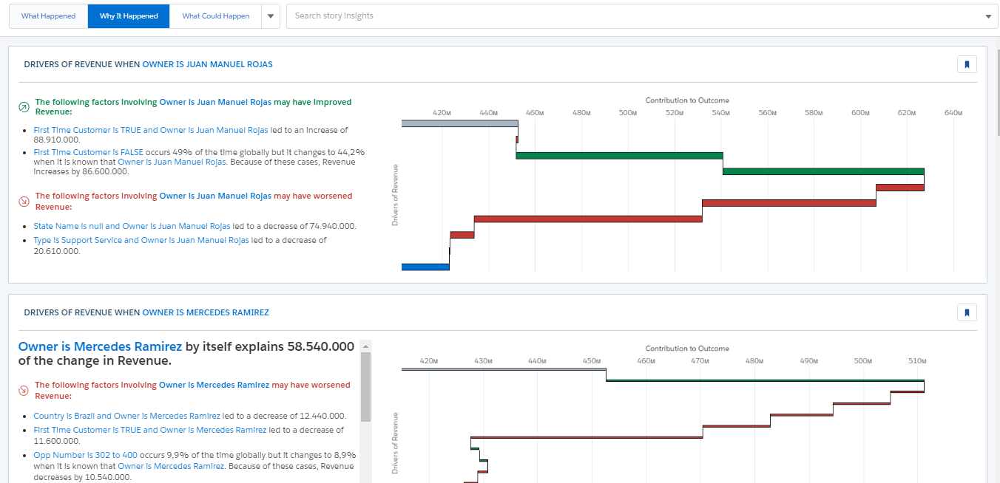
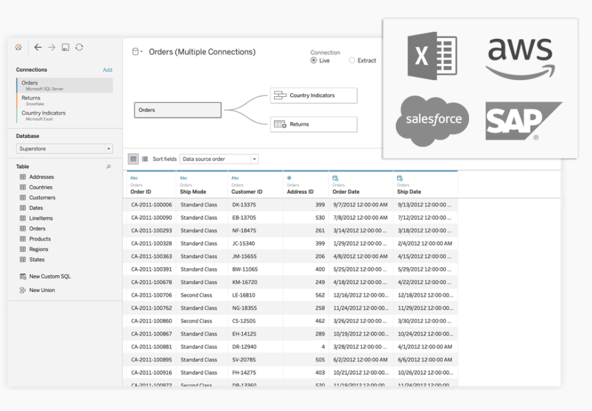

En junio del 2019, salesforce compró definitivamente Tableau, el líder en software de Business Intelligence (BI), en la adquisición más grande de la historia de la empresa líder en crm, pero recientemente pudimos ver los cambios que se desencadenaron por esta adquisición.
Esta semana decidimos hablar de BI y Salesforce.

Primero lo primero, que es BI?
2020 ha sido el año donde se ha confirmado lo necesario de medir y recabar datos de todo lo que hacemos para una mejor toma de decisiones para entender las situaciones actuales y futuras.
En ese sentido los software de Business intelligence son imprescindibles para que las organizaciones puedan explotar todo lo que recogen a partir de las interacciones con clientes, proveedores y demás actores de su vida cotidiana.
Saber usar alguno, es una habilidad cada vez más requerida, no sólo en puestos de sistemas sino también en puestos relacionados a lo comercial y el negocio. Porque siendo sincero, todos trabajamos con información y lo mejor es tenerla organizada y explotarla al máximo. Pasar del excel al BI es un paso difícil pero también necesario.

Cuando hemos dicho que salesforce tiene productos para todo lo que te puedas imaginar y más, no mentimos. De hecho no solo tiene un producto para BI si no que tiene una suite entera

Antes de la adquisición de Tableau, el módulo BI insignia de Salesforce era Einstein Analytics. Esta semana se anunció que cambia su nombre a Tableau CRM para ser la alternativa BI para el usuario CRM y poder trabajar junto a la potencia de Tableau.

Analytics te permite hacer gráficos rápidamente tomando los datos de salesforce nativamente o 3rd party sources. Tiene además una herramienta muy potente llamada Einstein Discovery, enfocada en machine learning la cual te permite generar insights y predicciones automáticamente con unos pocos clicks y parametrizaciones.

Queres aprender mas de Einstein Analytics: [Mira esto](https://trailhead.salesforce.com/es-MX/users/ea-trails/trailmixes/learn-einstein-analytics-plus).

Ahora hablemos de Tableau

No miento al decir que Tableau es una herramientas líderes del mercado de BI, es usado en muchísimas empresas por su robustez, facilidad y amplia comunidad. En mi experiencia personal, Tableau es tan fácil de usar que cualquier usuario incluso alguien que no esté formado en sistemas, puede hacer gráficos complejos que respondan las preguntas que tenga.

Tableau te permite integrar datos de todos lados, tiene múltiples conectores y es muy útil para integrar todos nuestros softwares y herramientas y además asegurar la gobernabilidad y disponibilidad de los datos a toda la organización.

Queres aprender mas sobre Tableau? [Mira estos videos](https://www.tableau.com/learn/training/20203)
