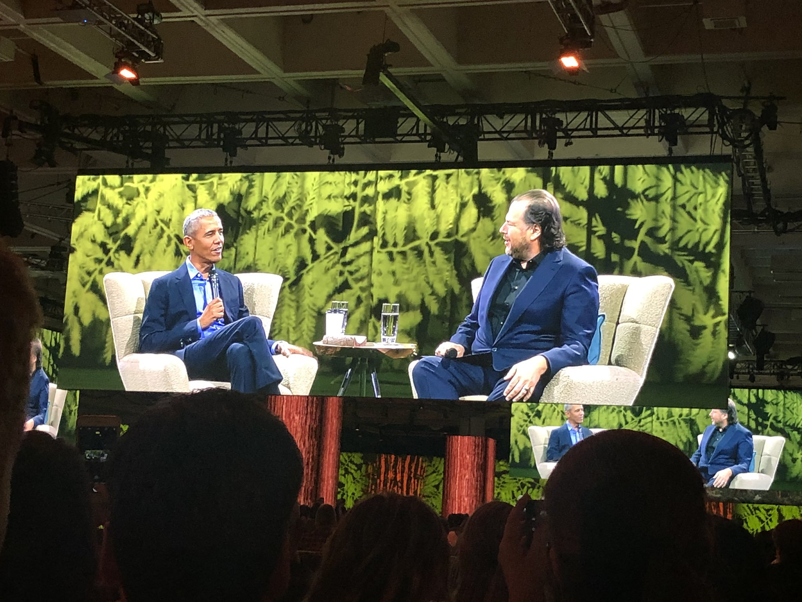

**Somos** unos fanáticos de salesforce, eso ya lo saben, pero no es solo por la tecnología, las herramientas y sus posibilidades, sino también por la cultura que hay a su alrededor.
Salesforce Ohana(así se le llama esta cultura) es algo que comparten aquellos que tienen un lugar en la comunidad salesforce y establece los valores para hacer de trabajar con salesforce algo divertido.
Ya hablamos de algunos de estos valores, el conocimiento abierto, la comunidad, la diversidad, la innovación, el customer success,etc. [Puedes conocer más sobre esta cultura acá](https://trailhead.salesforce.com/es-MX/content/learn/modules/manage_the_sfdc_way_ohana).

Todo esto converge en un evento, la Dreamforce, que se realiza todos los años desde 2013. No es un ciclo de conferencias sobre tecnología, va mucho más allá. Es una celebración anual, un evento que une a las mentes dentro de salesforce. Es una experiencia 360 que conecta personas.
A excepción de 2020, que será virtual, el evento se organiza durante 4 días en la ciudad de San Francisco, y, si bien tiene charlas de tecnología y sobre casos de éxito con salesforce, también tiene expositores dando charlas sobre los más diversos temas de tecnología, emprendedurismo y cuestiones sociales.
En años anteriores estuvieron, entre otros, Megan Rapinoe,David Beckham, Tim Cook,Emilia Clarke,Al Gore,Michelle Obama, Hillary Clinton,Ashton Kutcher y nada más y nada menos, que Barack Obama.

Además hay stands de exposición donde están la mayoría, si no todos, los partners de Salesforce alrededor del mundo mostrando sus casos de éxito e innovación con Salesforce.

Y como en salesforce además de la tecnología nos gusta divertirnos, dreamforce es todo diversión. Juegos, concursos y sobre todo CONCIERTOS. En años anteriores estuvieron tocando bandas y artistas como The Foo Fighters, Metallica(amigos personales del fundador de salesforce, Marc Benioff),INXS,Red hot Chilli Peppers,Bruno Mars,Green Day,U2 y muchas más.
¿Es como un Lollapalooza con charlas de tecnología, no?

Además la dreamforce es una oportunidad para todo San Francisco, ya que llena los hoteles de la ciudad e incrementa la actividad comercial en la zona.

Estos dos autores, no fueron aún a este gran evento pero no faltará la oportunidad y vamos a contarles con lujo de detalles desde el momento que subamos al avión.

Este año, la Dreamforce será virtual(Dreamforce to you) por la pandemia entre fines de noviembre y principios de diciembre, todavía no hay speakers ni agenda confirmada pero pueden [registrarse gratuitamente en este link.](https://www.salesforce.com/dreamforce/)

Si en este punto, te emocionaste tanto como nosotros, [te dejamos videos sobre dreamforce anteriores.](https://www.youtube.com/results?search_query=dreamforce)  
**¿Ya estás registrado?**

### Nos vemos en la dreamforce.
